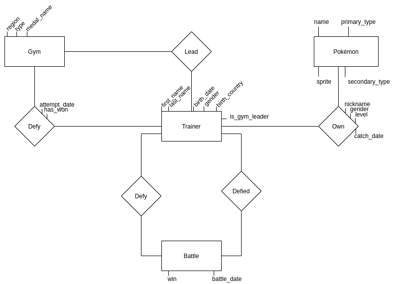

### A.2 Individuazione della base di dati

**Schema relazionale in meta notazione**

<small>
L'attributo sprite un il dummy field che abbiamo utilizzato per aumentare la dimensione delle tuple della relazione pokemon, siamo consapevoli che non è buona pratica salvare file all'interno di un database.
</small>

**Codice sql per la creazione dello schema relazionale**
``` sql
@file(../sql/1_create_tables.sql)
```

**Dimensioni tabelle create**  
@queryFile(../sql_queries/table_sizes.sql)

**Approccio utilizzato per la generazione dell'istanza**  
Per la generazione dei dati abbiamo utilizzato un semplece script, scritto da noi, che genera il codice sql delle insert che inseriscono un numero arbitrario di tuple su ogni tabella, in base alla configurazione, è possibile consultare il suddetto script sul repo github indicato.